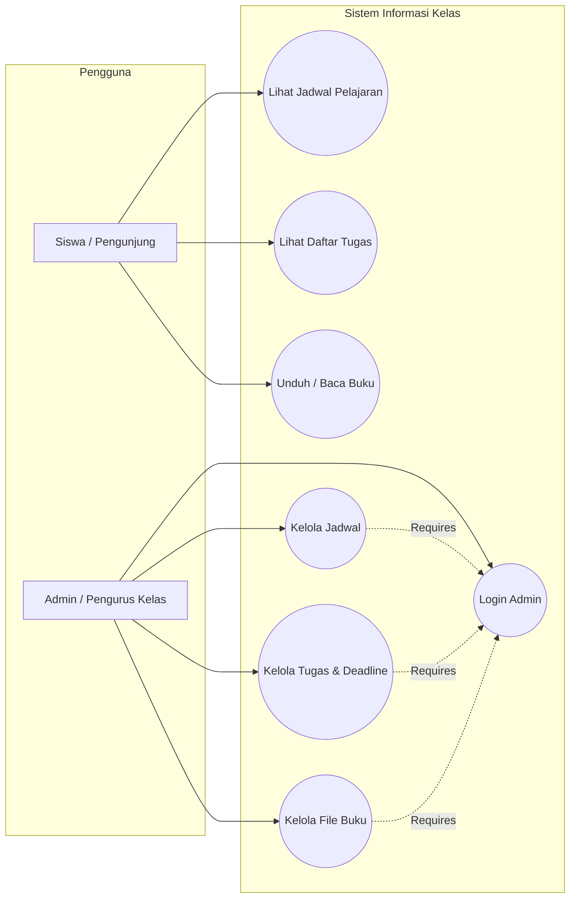

# Website Informasi Kelas

Website pusat informasi kelas yang dirancang untuk memudahkan siswa dalam mengakses **jadwal pelajaran**, **tugas-tugas sekolah**, serta **buku pelajaran digital** sesuai mata pelajaran. Dilengkapi dengan **Panel Admin** agar pengurus kelas seperti ketua kelas dapat dengan mudah mengelola dan mengupdate konten secara realtime.

Demo: https://web-kelas.rayyan.web.id

## Teknologi yang Dibuat

- **Bahasa**: TypeScript
- **Framework**: Next.js
- **Styling**: TailwindCSS
- **Database**: PostgreSQL
- **ORM**: Prisma

## Fitur Utama

### Sisi Siswa (Public)
- **Jadwal Pelajaran**: Melihat jadwal mata pelajaran harian beserta jam pelajaran dan guru pengampu.
- **Daftar Tugas**: Informasi tugas sekolah lengkap dengan *deadline*, instruksi, dan mata pelajaran terkait.
- **Buku Pelajaran**: Akses dan unduh file/buku paket digital yang terorganisir per mata pelajaran.

### Sisi Admin (Dashboard Admin)
- **Kelola Jadwal Pelajaran**: Tambah, ubah, atau hapus jadwal harian.
- **Kelola Tugas**: Buat tugas baru dan atur batas waktu pengumpulan (*deadline*).
- **Kelola Buku & Modul**: Memasukkan link file buku pelajaran sesuai mata pelajaran masing-masing.
- **Autentikasi**: Akses khusus admin untuk menjaga keamanan data kelas.

## Alur Program

